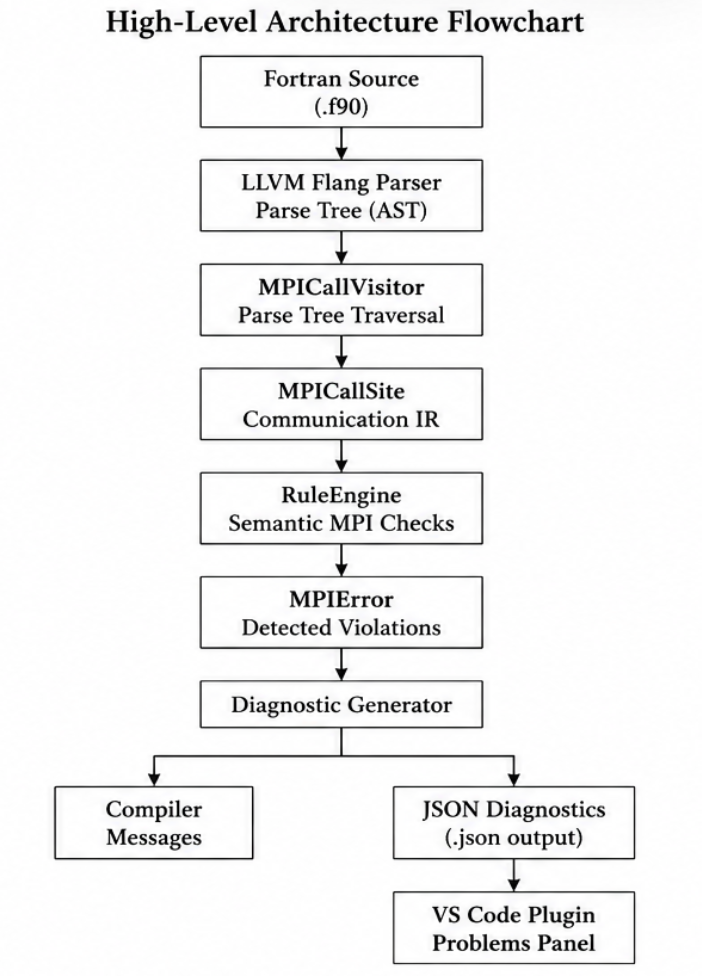
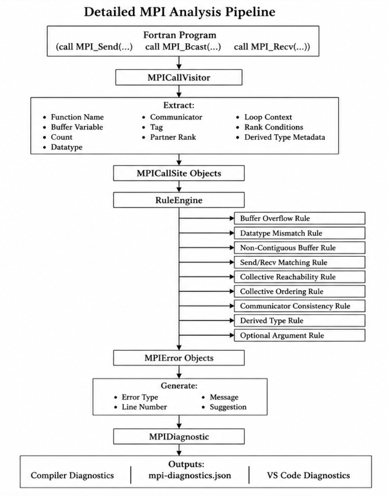

# DESIGN.md

# MPI Semantic Analyzer for LLVM Flang — Design Document

## 1. Introduction

This document describes the design of the MPI Semantic Analyzer integrated into LLVM Flang.

The primary objective of the project is to detect MPI correctness issues statically during compilation without requiring execution of the target program.

The analyzer operates during Flang semantic analysis and performs rule-based verification of MPI communication patterns extracted from the parse tree.

---

# 2. Design Goals

The project was designed with the following goals:

## Correctness

Detect common MPI programming errors before runtime.

## Compiler Integration

Integrate naturally into the existing Flang semantic analysis pipeline.

## Extensibility

Allow new MPI rules to be added without modifying the extraction infrastructure.

## Low Overhead

Perform analysis using information already available during semantic processing.

## Tooling Support

Produce structured diagnostics suitable for IDE and external tool integration.

---

# 3. High-Level Architecture

The system consists of four major stages.

Fortran Source
→ Parse Tree
→ MPICallVisitor
→ MPICallSite Collection
→ RuleEngine
→ Diagnostics
→ JSON Output

---

# High-Level Architecture Flowchart

 Figure 1: High-level architecture of the MPI Semantic Analyzer.

Explanation:

The compiler extracts MPI communication semantics from the parse tree, converts them into MPICallSite objects, analyzes them using RuleEngine, and produces both compiler diagnostics and machine-readable JSON output. The JSON diagnostics can then be consumed by external tooling such as the VS Code extension.

# Detailed MPI Analysis Pipeline

Figure 2: Detailed MPI analysis and diagnostic generation workflow.

# 4. MPICallSite Representation

The central intermediate representation is MPICallSite.

Each MPI call is transformed into a structured record containing:

* Function name
* Source line number
* Buffer information
* Count information
* MPI datatype
* Communicator
* Partner rank
* Message tag
* Collective status
* Loop context
* Conditional context
* Derived type metadata

This representation decouples extraction from analysis.

---

# 5. MPI Call Extraction Design

MPI extraction is implemented using a parse-tree visitor.

Responsibilities:

* Detect MPI routines
* Extract arguments
* Infer variable properties
* Record communication metadata

Advantages:

* Reuses Flang semantic information
* Avoids additional parsing
* Easily extensible for new MPI routines

---

# 6. Rule Engine Design

The RuleEngine is responsible for semantic verification.

Each analysis rule is implemented independently.

Examples:

* Buffer overflow
* Datatype mismatch
* Send/receive mismatch
* Collective reachability
* Collective ordering
* Derived datatype validation

Advantages:

* Modular
* Easy to maintain
* Simple addition of new rules

---

# 7. Diagnostic Design

All rule violations are represented using MPIError.

Each error contains:

* Rule type
* Line number
* Message
* Suggested fix

This allows both console diagnostics and JSON export to share a common format.

---

# 8. JSON Diagnostic Architecture

Diagnostics are exported to JSON.

Benefits:

* IDE integration
* CI/CD integration
* Machine-readable output
* Future LSP support

Each entry includes:

* File
* Line
* Column
* Severity
* Rule identifier
* Message
* Suggestion

---

# 9. VS Code Integration Design

The VS Code extension consumes generated diagnostics.

Workflow:

Fortran File
→ Flang MPI Analysis
→ JSON Diagnostics
→ VS Code Extension
→ Problems Panel

The extension remains independent from the compiler and communicates solely through diagnostic JSON files.

---

# 10. Design Tradeoffs

## Chosen

Rule-based analysis

Benefits:

* Simple implementation
* Predictable behavior
* Easy debugging

## Not Chosen

Full interprocedural dataflow analysis

Reason:

* Significantly higher implementation complexity
* Outside project scope

---

# 11. Future Extensions

Potential enhancements:

* Automatic fixes
* LSP integration
* Dataflow analysis
* Interprocedural MPI reasoning
* User-defined datatype validation
* Collective synchronization modeling

---

# 12. Conclusion

The design separates extraction, analysis, diagnostics, and visualization into independent components, creating a modular and extensible framework for MPI static analysis inside LLVM Flang.
